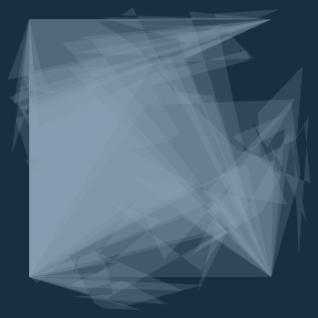

## Paintnine

Make lovely art with paintnine!

Paintnine uses [plotnine](https://plotnine.readthedocs.io/en/stable/) to make generative art in Python.

### Installation

You can install paintine from PyPI with:

``` 
python -m pip install paintnine
```

### Example

``` python
import paintnine as pa9
square = pa9.get_square()
_ = pa9.grow_multipolygon(square, 15, 12)
pa9.show_multipolygon(_, fill = "#91a9ba", bgd = '#182f40')
```




